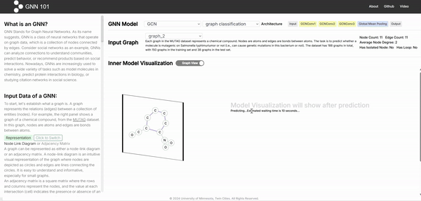

<p align="center">
  
</p>

<h1 align="center">GNN 101</h1>
<h3 align="center">Visual Learning of Graph Neural Networks in Your Web Browser</h3>

<p align="center">
  <a href="https://visual-intelligence-umn.github.io/web-gnn-vis"></a>
  <a href="https://visual-intelligence-umn.github.io/web-gnn-vis"></a>
  <a href="https://www.youtube.com/watch?v=_0jXy4Zoh-o"></a>
  <a href="https://arxiv.org/abs/2411.17849"></a>
  <a href="https://ieeexplore.ieee.org/document/11263953/"></a>
  
</p>

---

<p align="center">
  
</p>
<p align="center">
  <em><b>GNN 101 demo:</b> Interactive interface for learning GNNs. Left panel shows educational content on graph concepts (node-link vs. adjacency matrix). Right panel visualizes a GCN model performing graph classification on the MUTAG dataset—chemical compounds where nodes are atoms and edges are bonds. Users can explore layer-by-layer computations and watch model predictions in real time.</em>
</p>

---

## Overview

**GNN 101** is an educational visualization tool for interactive learning of Graph Neural Networks. It seamlessly integrates mathematical formulas with visualizations via multiple levels of abstraction, including a model overview, layer operations, and detailed animations for matrix calculations.

### Key Features

- **Dual Views**: Switch between a *node-link view* for intuitive graph understanding and a *matrix view* for a comprehensive overview of features and transformations across layers
- **No Installation**: Open-source and runs directly in web browsers
- **Interactive Learning**: Demystifies GNN computations with engaging animations and visual explanations
- **Layer-by-Layer Insight**: Illustrates what a GNN learns about graph nodes at each layer

---

## Team

Yilin Lu, Chongwei Chen, Yuxin Chen, Kexin Huang, Marinka Zitnik, Qianwen Wang

---

## Paper

📄 **[GNN 101: Visual Learning of Graph Neural Networks in Your Web Browser](https://arxiv.org/abs/2411.17849)**  
- [arXiv](https://arxiv.org/abs/2411.17849) · [IEEE Xplore](https://ieeexplore.ieee.org/document/11263953/)

> Graph Neural Networks (GNNs) have achieved significant success across various applications. However, their complex structures and inner workings can be challenging for non-AI experts to understand. To address this issue, we present GNN 101, an educational visualization tool for interactive learning of GNNs. GNN 101 seamlessly integrates mathematical formulas with visualizations via multiple levels of abstraction, including a model overview, layer operations, and detailed animations for matrix calculations. Users can easily switch between two complementary views: a node-link view that offers an intuitive understanding of the graph data, and a matrix view that provides a space-efficient and comprehensive overview of all features and their transformations across layers. GNN 101 not only demystifies GNN computations in an engaging and intuitive way but also effectively illustrates what a GNN learns about graph nodes at each layer.

---

## Getting Started

### Prerequisites

- Node.js 18+
- npm, yarn, pnpm, or bun

### Installation

```bash
# Clone the repository
git clone https://github.com/Visual-Intelligence-UMN/web-gnn-vis.git
cd web-gnn-vis

# Install dependencies
npm install
```

### Run Locally

```bash
npm run dev
# or: yarn dev | pnpm dev | bun dev
```

Open [http://localhost:3000](http://localhost:3000) in your browser.

---

## Citation

If you find GNN 101 useful, please cite our paper:

```bibtex
@article{gnn101,
  title={GNN 101: Visual Learning of Graph Neural Networks in Your Web Browser},
  author={Lu, Yilin and Chen, Chongwei and Yuxin Chen and Huang, Kexin and Zitnik, Marinka and Wang, Qianwen},
  journal={IEEE Transactions on Visualization and Computer Graphics},
  year={2025}
}
```

---

## License

This project is open-source. Please see the repository for license details.
